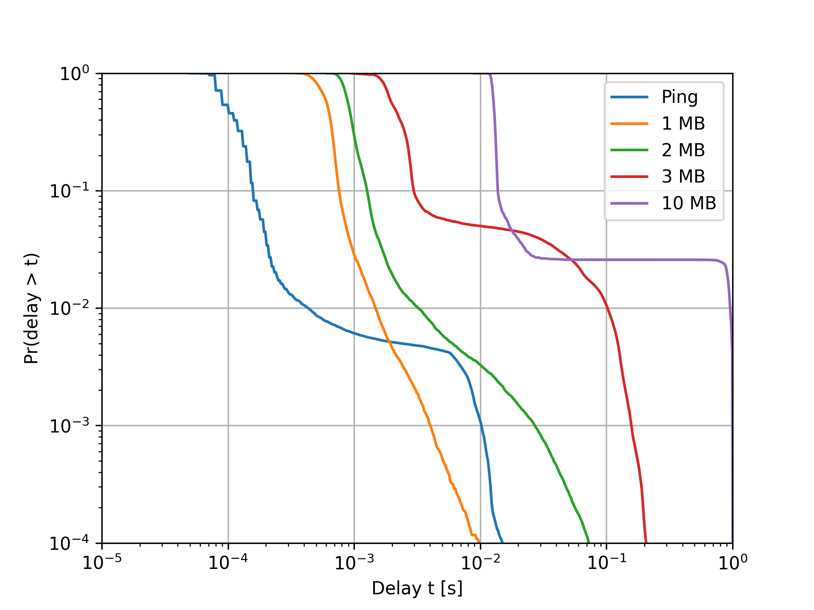

# network-delay-trace
A set of scripts to help measure and analyze network delay. Relies on
`fping` and `iperf3` for measurements.

# `fping` traces
Measure ping delay against a remote sever using `fping` and output csv:
``` shell
fping -l google.com | python3 fping_parser.py --csv --write-header
host, seq, bytes, ms
google.com, 0, 84, 21.9
google.com, 1, 84, 23.0
google.com, 2, 84, 22.0
google.com, 3, 84, 23.3
...
```
Alternatively, output JSON:
``` shell
fping -l google.com | python3 fping_parser.py --json
{"host": "google.com", "seq": 0, "bytes": 84, "ms": 19.9}
{"host": "google.com", "seq": 1, "bytes": 84, "ms": 21.1}
{"host": "google.com", "seq": 2, "bytes": 84, "ms": 36.7}
{"host": "google.com", "seq": 3, "bytes": 84, "ms": 19.8}
...
```
Write samples to `fping_traces.csv`:
``` shell
fping -l google.com | python3 fping_parser.py --csv --write-header > fping_traces.csv
```
Append samples to an existing file:
``` shell
fping -l google.com | python3 fping_parser.py --csv >> fping_traces.csv
```

# `iperf3` traces
Measure the delay associated with transferring small files to a `iperf3` server running on localhost and output csv:
``` shell
iperf3 -s # start iperf3 server, run in separate terminal
python3 iperf_trace.py --server 127.0.0.1 --loop --csv --write-header
timestamp, seconds, bytes
1587980180, 0.000546, 2621440
1587980180, 0.000797, 2621440
1587980180, 0.001814, 7864320
1587980180, 0.002081, 7864320
...
```
``` shell
python3 iperf_trace.py --server 127.0.0.1 --loop --json
{"timestamp": 1587982803, "seconds": 0.001819, "bytes": 9175040}
{"timestamp": 1587982803, "seconds": 0.000382, "bytes": 1310720}
{"timestamp": 1587982803, "seconds": 0.002226, "bytes": 10485760}
{"timestamp": 1587982803, "seconds": 0.002196, "bytes": 10485760}
...
```
Writing the output to a file can be done in the same way as for `fping`.

# Delay distribution
Plot delay distribution from samples in `fping_traces.csv` and `iperf_traces.csv`:
``` shell
python3 plot.py --fping fping_traces.csv --iperf iperf_traces.csv
```

*Complementary cumulative distribution function of network delay on Amazon EC2.*
